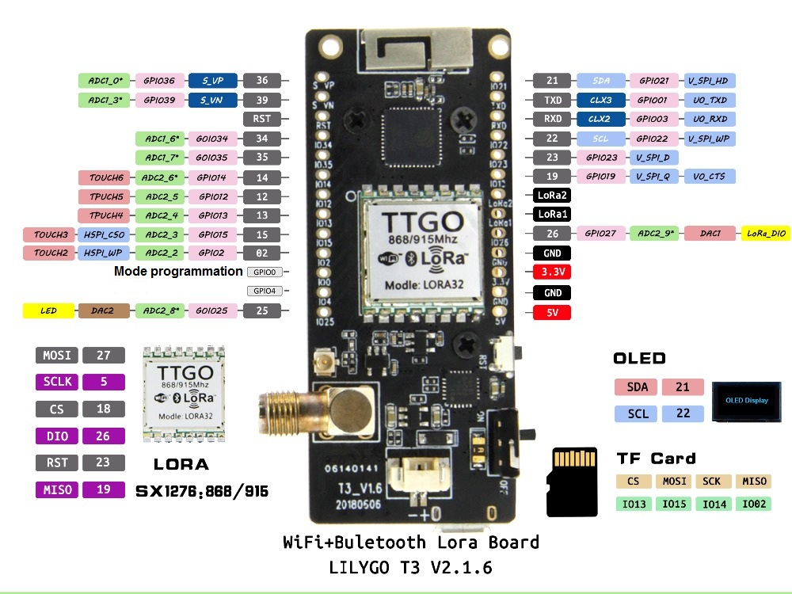
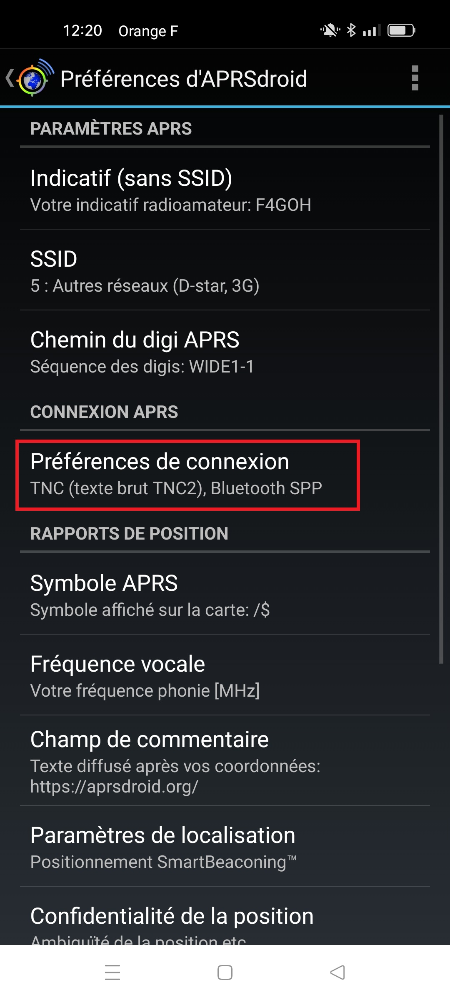
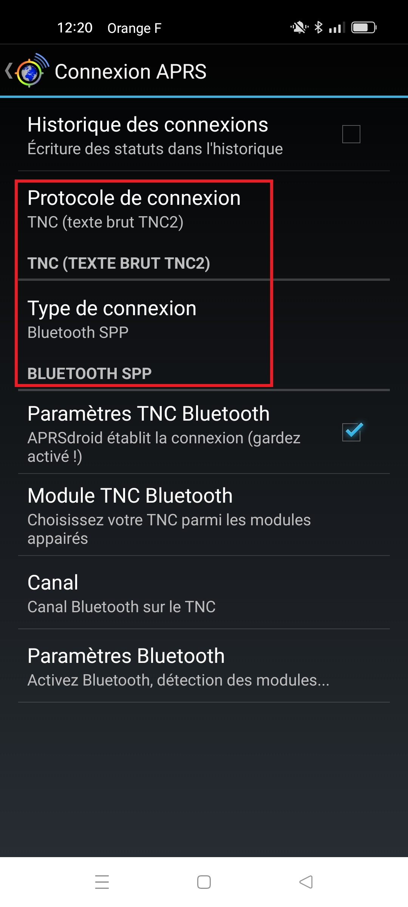
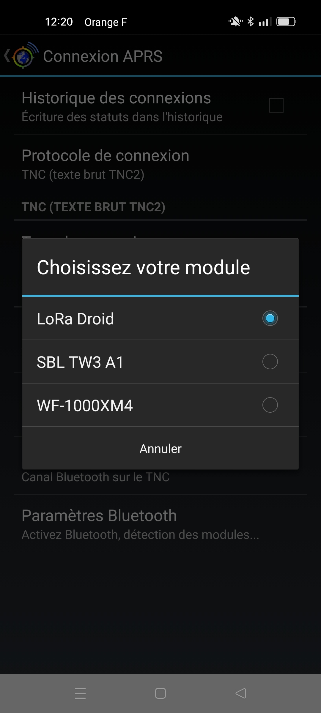
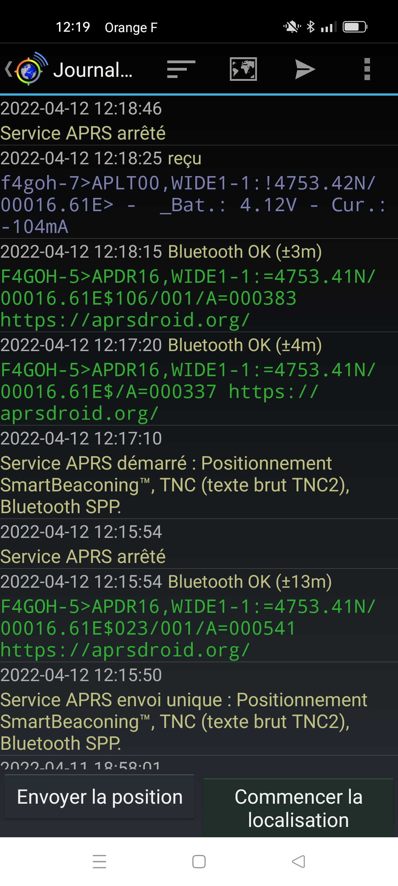
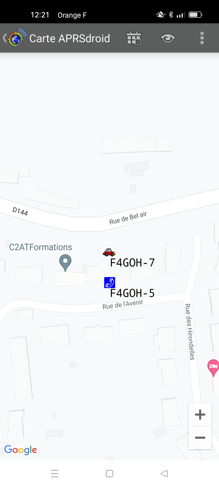

# Bluetooth

## Automatic installation [firmwares](https://f4goh.github.io/lora-aprs-esp32/index.html) 

***
## TTGO BOARD



***

Serial monitor 115200 Bauds

```console
rst:0rst:0x1 (POWERON_RESET),boot:0x13 (SPI_FAST_FLASH_BOOT)
configsip: 188777542, SPIWP:0xee
clk_drv:0x00,q_drv:0x00,d_drv:0x00,cs0_drv:0x00,hd_drv:0x00,wp_drv:0x00
mode:DIO, clock div:2
load:0x3fff0018,len:4
load:0x3fff001c,len:1044
load:0x40078000,len:10124
load:0x40080400,len:5828
entry 0x400806a8
Set SPI pins!
Set LoRa pins!
frequency:
433775000
LoRa init done!
Tache RX en fonctionnement
Tache Afficheur en fonctionnement

>Press m key to enter menu
...help command for info

>help
Available commands
Set callsign for digi                          : call f4goh-6
Set frequency                                  : freq 433775000
Set latitude in degrees minutes decimal        : latitude 4753.41N
Set longitude in degrees minutes decimal       : longitude 00016.61E
Set new comment                                : comment hello
Set Digipeater enable (0 or 1)                 : digi 1
Show configuration                             : show
Reset default configuration                    : raz
Exit menu                                      : exit
>show
Call is             : f4goh-3
Frequency is        : 433775000
latitude is         : 4756.57N
longitude is        : 00016.03E
Digipeater is       : Disable
Comment is          : digi bt
>>exit
>
 Console exit
bluetooth gate
Tache RX Droid en fonctionnement
Access point BT enable
```












