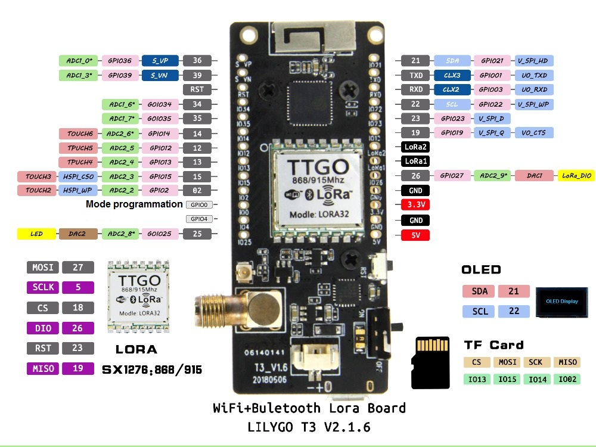
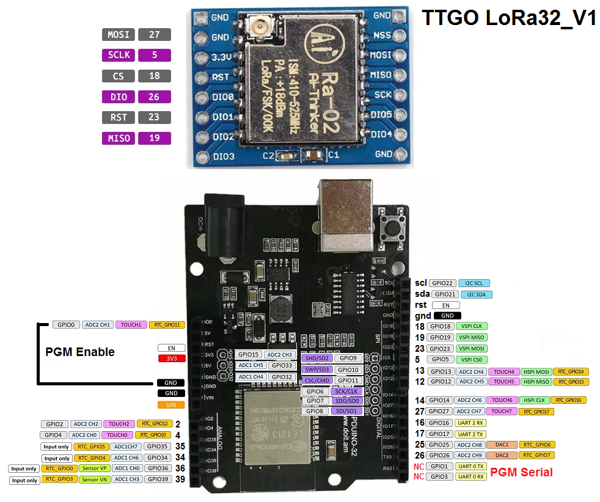
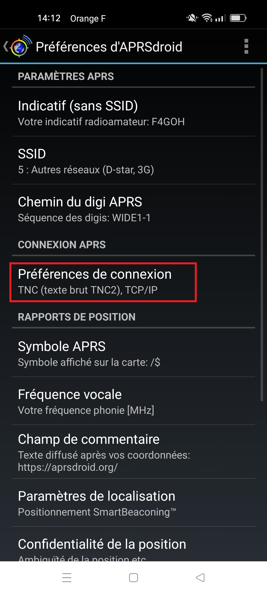
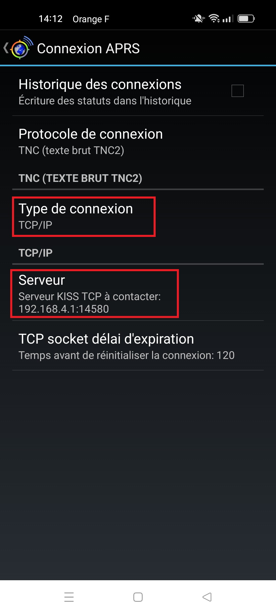

# Igate

## Automatic installation [firmwares](https://f4goh.github.io/lora-aprs-esp32/index.html) 

***
## TTGO BOARD



***

## TTGO TEST with esp32 and RA02 (SX1278)

Igate software recognize TTGO lora32 V1

change i2c lines in BoardFinder.cpp file to use ssd1306 display

```c++
BoardConfig TTGO_LORA32_V1        ("TTGO_LORA32_V1",         eTTGO_LORA32_V1,          21, 22, 0x3C,  0,  5, 19, 27, 18, 14, 26);
```




Serial monitor 115200 Bauds

```console
rst:0rst:0x1 (POWERON_RESET),boot:0x13 (SPI_FAST_FLASH_BOOT)
configsip: 188777542, SPIWP:0xee
clk_drv:0x00,q_drv:0x00,d_drv:0x00,cs0_drv:0x00,hd_drv:0x00,wp_drv:0x00
mode:DIO, clock div:2
load:0x3fff0018,len:4
load:0x3fff001c,len:1044
load:0x40078000,len:10124
load:0x40080400,len:5828
entry 0x400806a8
Set SPI pins!
Set LoRa pins!
frequency:
433775000
LoRa init done!
Tache RX en fonctionnement
Tache Afficheur en fonctionnement

>Press m key to enter menu
..help command for info

>help
Available commands
Set ssid                                       : ssid mywifi
Set password                                   : pass toto
Set new callsign                               : call f4goh-6
Set latitude in degrees minutes decimal        : latitude 4753.41N
Set longitude in degrees minutes decimal       : longitude 00016.61E
Set new comment                                : comment hello
Set frequency                                  : freq 433775000
Enable wifi for igate (aprs.fi)                : internet 1
Enable local wifi Access Point for AprsDroid   : internet 0
When disable igate, local wifi AP are enable
Set server                                     : server euro.aprs2.net
Set port                                       : port 14580
Set Digipeater enable (0 or 1)                 : digi 1
Show configuration                             : show
Reset default configuration                    : raz
Exit menu                                      : exit
>show
Ssid is             : Livebox-xxxx
password is         : toto
Call is             : f4goh-1
Frequency is        : 433775000
latitude is         : 4753.41N
longitude is        : 00016.61E
Internet is         : Enable
TCP Access point is : Disable
Server is           : euro.aprs2.net
Port is             : 14580
Digipeater is       : Disable
Comment is          : LoRa iGATE : https://github.com/f4goh/lora-aprs-esp32
>exit
>
 Console exit
wifi igate on internet
15001
Client Wifi
.....
WiFi connecté
Adresse IP : 192.168.1.36
Adresse IP de la gateway : 192.168.1.1
Tache Wifi en fonctionnement
Tache APRS-IS en fonctionnement
Connexion au serveur Aprs done
231220
Re init Connexion APRS..
connexion Serveur APRS en cours...
user f4goh-1 pass 15001 vers ESP32-APRS-IS 1.0
connexion au serveur aprs
# aprsc 2.1.11-g80df3b4
# logresp f4goh-1 verified, server T2BIO
Connexion APRS ok
f4goh-1>APLG01:=4753.41NL00016.61E&LoRa iGATE : https://github.com/f4goh/lora-aprs-esp32
```
***
## APRSDroid in ACCESS POINT

Be careful SSID and password ACCESS point same as Client Wifi

```console
Enable local wifi Access Point for AprsDroid   : internet 0
```






