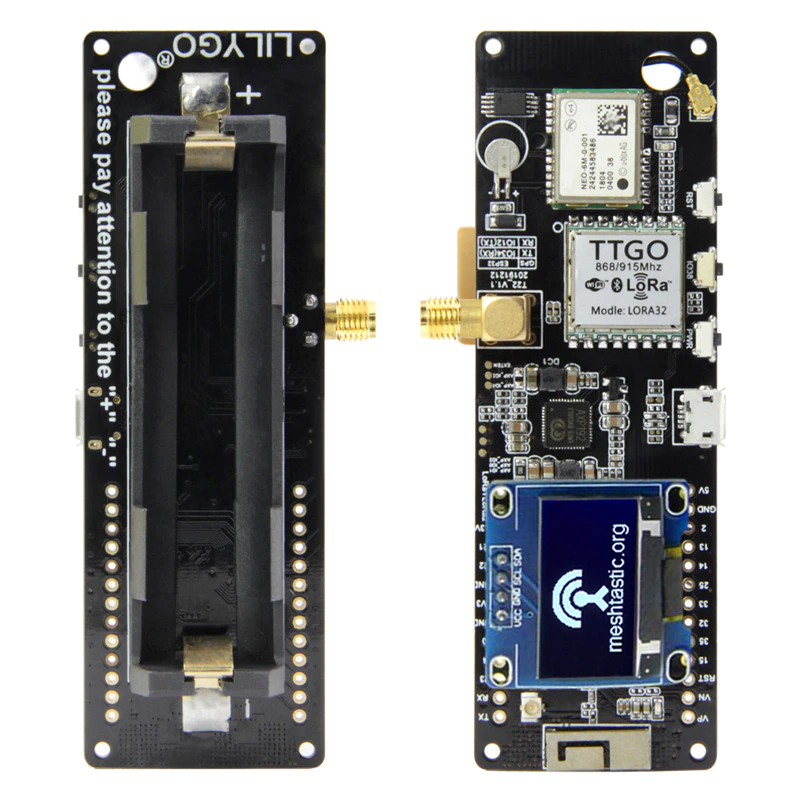
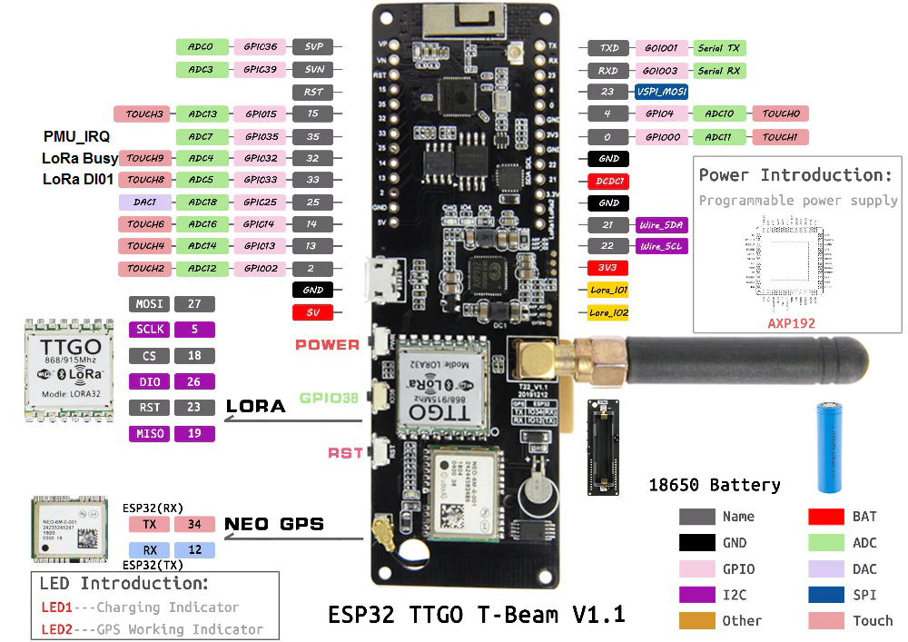
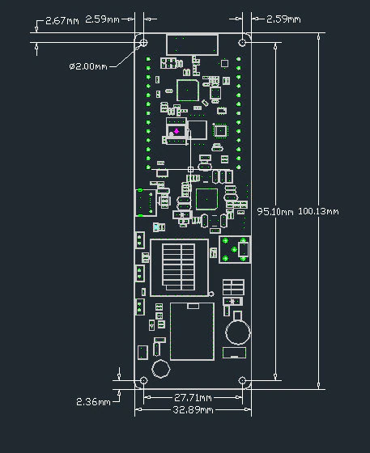

# Tracker

## Automatic installation [firmwares](https://f4goh.github.io/lora-aprs-esp32/index.html) 

[Reset GPS](https://github.com/lora-aprs/TTGO-T-Beam_GPS-reset) 1st on TTGO before programming 

Complementary files

- AXP192 (power management)
- LilyGo_TBeam_V1.1 schematics

***
## TTGO BOARD



***

## TTGO PINOUT



## TTGO mechanical dimension



Serial monitor 115200 Bauds

```console
rst:0x1 (POWERON_RESET),boot:0x13 (SPI_FAST_FLASH_BOOT)
configsip: 0, SPIWP:0xee
clk_drv:0x00,q_drv:0x00,d_drv:0x00,cs0_drv:0x00,hd_drv:0x00,wp_drv:0x00
mode:DIO, clock div:2
load:0x3fff0018,len:4
load:0x3fff001c,len:1044
load:0x40078000,len:10124
load:0x40080400,len:5828
entry 0x400806a8
AXP192 init done!
Set SPI pins!
Set LoRa pins!
frequency:
433775000
LoRa init done!

>Press m key to enter menu
..help command for info

>help
Available commands
Set new callsign                            : call f4goh-6
Set frequency                               : freq 433775000
Set car symbol                              : symbol >
Set new comment                             : comment hello
Set Battery measurement in comment (0 or 1) : setbat 1
Set altitude feild in pdu (0 or 1)          : setalt 1
Set Course/Speed feild in pdu (0 or 1)      : setcs 1
Set compression position (0 or 1)           : setcomp 1
Show configuration                          : show
Reset default configuration                 : raz
Exit menu                                   : exit
>show
Call is                : f4kmn-12
Symbol is              : O
Frequency is           : 433775000
Transmit at second     : 20
Battery measurement is : Enable
Altitude is            : Enable
Course/Speed is        : Enable
Compression is         : Disable
Comment is             : hello
>>exit
>
 Console exit
13:41:17
13:41:18
13:41:19
13:41:20
f4kmn-12>APLT00,WIDE1-1:!4753.41N/00016.61EO000/000/A=000260Bat:4.12V/ 0mA
13:41:24
13:41:25
13:41:26
```

